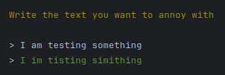

# Prigrimi (Text Annoyer)

This is a simple Go application that takes a user's input and replaces all vowels with the letter 'i' to create an "annoying" version of the text.



## Motivation
This project was created to practice Go programming and to create a simple application that could be used as a base for learn and teach Go basics.

Thanks to Angie for the original and unintentional idea.

## Running
These instructions will get you a copy of the project up and running on your local machine for development and testing purposes.

### Prerequisites
- Go 1.22 or higher.

### Installing
1. Clone the repository
```bash
$ git clone https://github.com/fselich/prigrimi.git
```

2. Run the application
```bash
$ go run main.go
```

3. Enter a string to be "annoyed"
```bash
  Write the text you want to annoy with

  > This is only a test                                                                                                                                                                                      
  > This is inly i tist
```

## License
This project is licensed under the GPLv3 License -- see the [LICENSE](LICENSE) file for details.